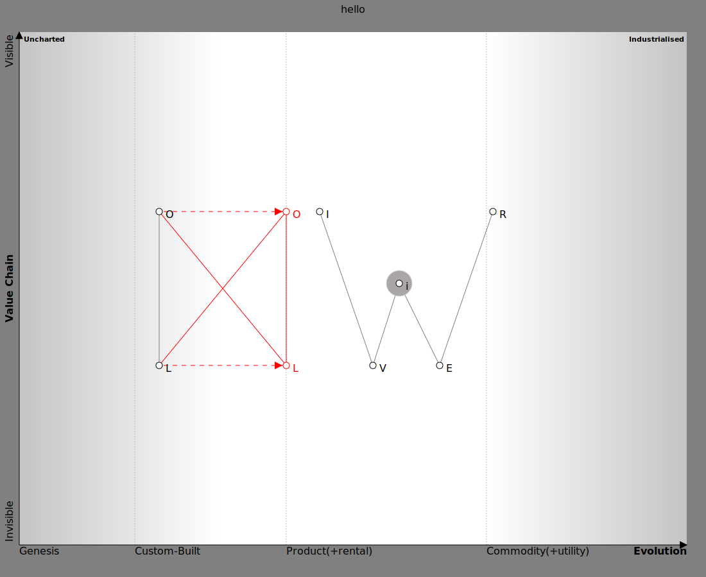
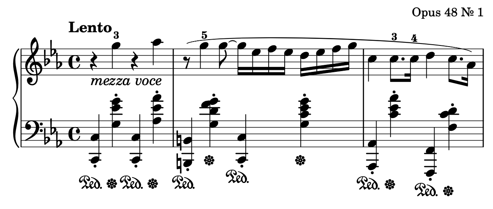

# Olivier Wulveryck

I am Olivier Wulveryck (he/him) from France.

<!--
**owulveryck/owulveryck** is a ✨ _special_ ✨ repository because its `README.md` (this file) appears on your GitHub profile.

Here are some ideas to get you started:

- 🔭 I’m currently working on ...
- 🌱 I’m currently learning ...
- 👯 I’m looking to collaborate on ...
- 🤔 I’m looking for help with ...
- 💬 Ask me about ...
- 📫 How to reach me: ...
- 😄 Pronouns: ...
- ⚡ Fun fact: ...
-->

I try to solve problems with digital tools. I code whenever I can...

## Consultant

I work for OCTO Technology as consultant.

Part of my job is to understand the business problems of the companies and to help them build the best solution.

I also like to keep a foot in the technological implementation.
For example [this tool](https://github.com/owulveryck/wardleyToGo) has been built to facilitate the generation of maps:

([source](consultant/ow.owm))

## Geek / Opensource contributor

I am a Gopher and I am contributing to various projects.

My main interest is for [Gorgonia](https://gorgonia.org) which is a library to facilitate machine learning in Go.

I am also the author of [onnx-go](https://github.com/owulveryck/onnx-go)

## Blogger

When I have time, I share my experiences on my [blog](https://blog.owulveryck.info)

## Musician

I love music and I am playing/learning the piano

([source](music/nocturneop48.ly))